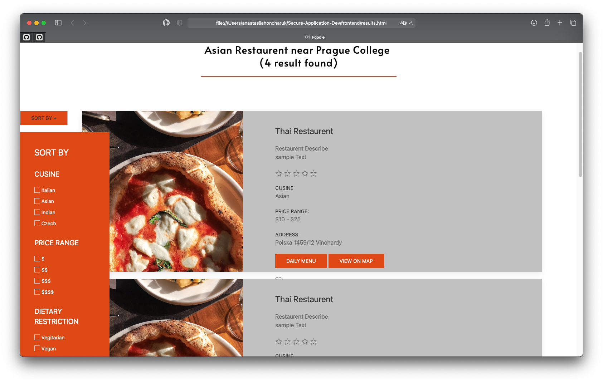

[](https://www.djangoproject.com)

# Foodle

A Django web application for finding fine places to eat.
Users can choose their preferences as well as use filtering in the application to receive a recommendation based on their liking.
The app works only on a fixed location (Prague College area).

## Technologies

- HTML5
- CSS3
- [UIkit](https://getuikit.com)
- [Django](https://www.djangoproject.com)
- [Yelp Fusion API](https://www.yelp.com/fusion) 
- [MongoDB Atlas](https://www.mongodb.com/cloud/atlas)
- [PythonAnywhere](https://eu.pythonanywhere.com) 

## Link to the application
https://anastasiiahoncharuk.eu.pythonanywhere.com/

## Screenshots

### Homepage: 


### Results page:



## Installation

Run this command in your terminal to download the project:
```sh
git clone https://github.com/lindamotejl/Secure-Application-Dev.git
```

## Contributing 

1. Fork your own copy of the project to your account
2. Create a new branch for your feature
3. Commit the changes
4. Push your changes to your fork
5. Open a pull request

## License
GNU General Public License v3.0. See `LICENSE` for more information. 

## Contributors

- [Jan Šaradin](https://github.com/h0nz1n)
- [Linda Motejl](https://github.com/lindamotejl)
- [Samuel Mathew](https://github.com/Sam2208)
- [Anothjeev Arunth](https://github.com/AnothJV)
- [Kevin Dhëmbi](https://github.com/KevinD)
- [Anastasiia Honcharuk](https://github.com/anastasiia724)
